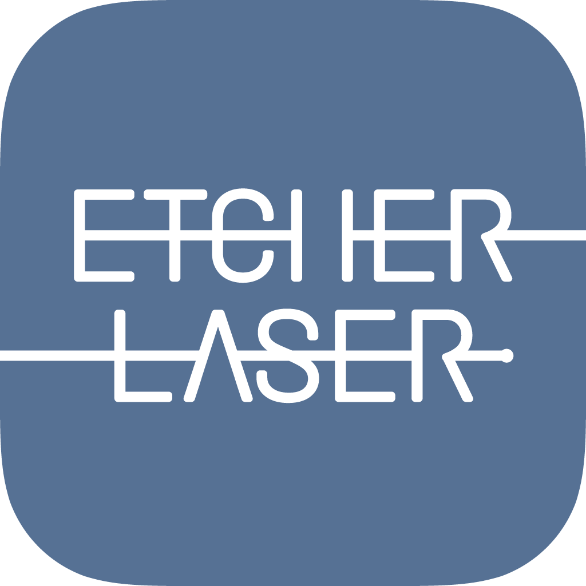
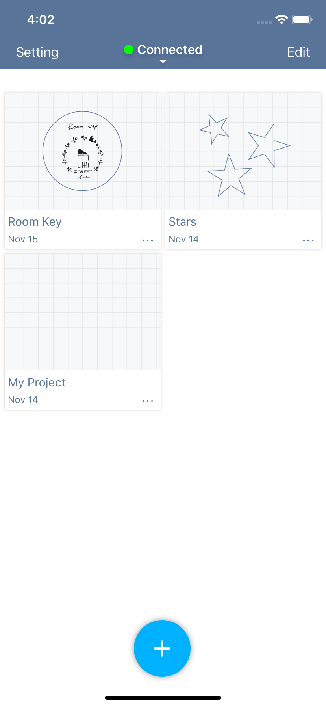
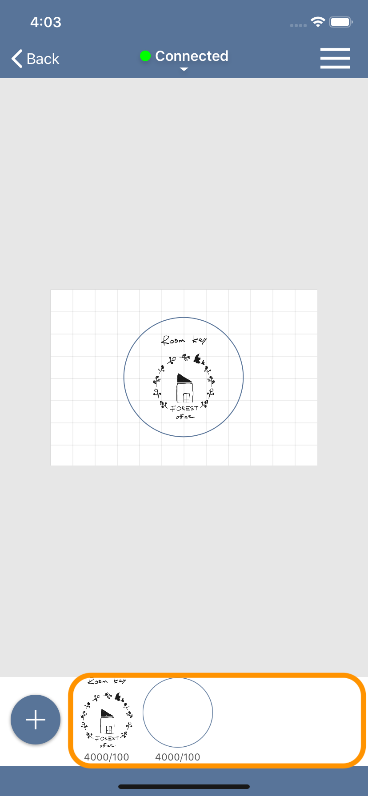
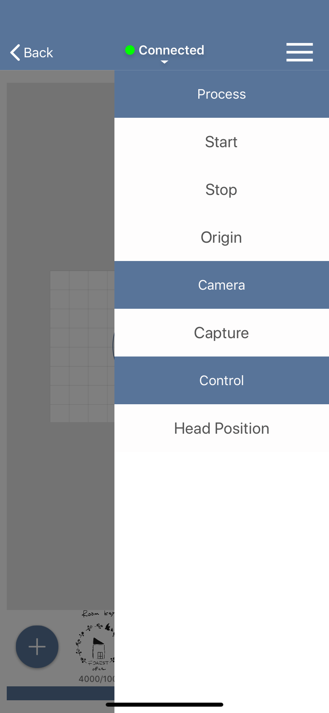

# 概要
EtcherLaser は EtcherLaserシリーズ対応の加工用アプリケーションです。
画像データを取り込んでレイアウトを編集し、レーザパラメータを設定して加工を行うことができます。

---

<p align="center">

</p>

## 製品仕様
### 対応製品
EtcherLaser

### 対応ファイル
png / jpg / tif

### ソフトウェアの動作要件
#### iOS
- iOS 11 以降

#### Android
- 未対応

## ご注意
- 本マニュアルのスクリーンショット等は実際のソフトウェアの表示と異なる場合がございます。
- 内容に関しては予告無しに更新されることがあります。
- 本製品の運用を理由とする損失、逸失利益などの請求につきましては、いかなる責任も負いかねますのであらかじめご了承ください。
- Apple、App Store、Apple ロゴ、Mac、Mac OS、OS X、macOS、iPad、iPhoto、iPod touch、および iTunes は、Apple Inc. の商標です。


https://web.messageplus.jp/information/help/app/iOS/index.html

<div style="page-break-before:always"></div>

# 各部名称
## プロジェクト一覧画面

作成したプロジェクトの一覧が表示されています。各プロジェクトをタップすると、プロジェクト編集画面が開きます。
また、セルの右下にある **…** をタップするとプロジェクト名の編集や、プロジェクトの複製・削除ができます。

<p align="center">

</p>

プロジェクトファイルをまとめて削除したい場合は、下記の手順で一括削除できます。
1. 画面右上の「編集」をタップして編集モードに切り替えます。
2. 削除するプロジェクトを一括選択します。
3. 画面左上のゴミ箱マークをクリックします。
4. 画面右上の「完了」をタップして編集モードを解除します。


## プロジェクト編集画面

この画面では、プロジェクトを編集して加工用データを作成できます。

### アイテム追加

左下の「+」ボタンをタップすると、加工アイテムを追加することができます。

- スキャン: 加工機本体のカメラでスキャンした画像を取り込みます。
- アセット: アプリに含まれるアセットから加工アイテムを追加することができます。
- テキスト: テキストから加工アイテムを追加することができます。
- ライブラリ: iOSのカメラロールに保存された画像からアイテムを追加することができます。
- カメラ: iOSのカメラを起動し、撮影した画像からアイテムを追加することができます。

<p align="center">

</p>

### アイテムリスト
画面下には追加したアイテム一覧が表示されています。
サムネイルをクリックするとパラメータ設定画面が表示されいます。
アイテムを削除したい場合は、サムネイルを長押して「削除」をタップします。

<p align="center">

</p>

### パラメータ設定画面
アイテムリストに表示されているアイテムをクリックすると表示され、対象のアイテムの加工パラメータを設定します。

- マニュアル: アイテムの加工の有効・無効やパラメータを手動で設定できます。また、設定したパラメータをユーザ辞書へ登録できます。
- ユーザ辞書: 登録したパラメータを選択できます。


### 加工機コントロールメニュー
- スタート: 対象のプロジェクトの加工データを作成し、加工機へ送信します。
- 動作停止: 加工中のEtcherLaserの動作を停止します。
- 原点復帰: レーザヘッドを機械原点へ移動します。
- キャプチャ: 加工エリアの画像をキャンバス上に表示します。
- 位置確認: レーザヘッドを移動させることができます。焦点距離の調整時に利用します。

<p align="center">

</p>

## 設定
- ユーザ設定: 各種設定を行うことができます。

<p align="center">

</p>

<div style="page-break-before:always"></div>

# パラメータ設定
ここでは、パラメータの設定項目について説明します。

<p align="center">

</p>


## スピード
加工中（レーザ照射中）のレーザヘッドの移動速度を設定します。スピードを遅くすると、素材に与えるレーザーのエネルギーが大きくなります。
```
※ 50 - 8000 [mm/min] の範囲で設定することができます。
```

## パワー
レーザ照射の強度を設定します。パワーが大きいほど素材に与えるレーザのエネルギーが大きくなります。
```
※ 0 - 100 [%] の範囲で設定することができます。
```

## 回数
レーザ加工の回数を指定します。１度に大きなエネルギーを与えると素材に悪影響（溶けや焦げ）が出てしまう場合、小さいエネルギーで繰り返し加工することで加工結果の改善が期待できます。
```
※ 0 - 10 [回] の範囲で設定することができます。
```

## DPI
ラスタ加工で有効になるパラメータです。画像の濃淡を表現するための処理（ディザリング）を行う際の解像度を設定します。デフォルトでは254DPIが設定されており、これは0.1mm毎にレーザが照射される値となります。また、液晶ディスプレイ等とは異なり、DPIを上げてもレーザ照射の点の大きさ自体は変わりません。DPIを上げすぎると全体が焼かれ過ぎてしまいますので、ご注意下さい。

```
※ 72 - 300 [DPI] の範囲で設定することができます。
※ 下記の画像は全て同じ画像データ及び同じ加工サイズで刻印しております。
※ 素材の特性や加工時間効率などに応じて個別に設定頂けます。
```

FABOOL Laser Mini 3.5W でダンボールに刻印 / 使用画像 : 1023x778 ピクセル

<p align="center">

</p>


## ハッチング
ベクタ（塗り）画像を加工する場合に有効になるパラメータです。ハッチングとは、細かい平行線を引き重ねて面を表現する方法であり、レーザ加工で「塗りつぶし」を表現するために行われます。ハッチングパラメータでは、この平行線同士の間隔を設定することができます。
```
※ 間隔は 0.05 - 3.0 [mm] の範囲で設定することができます。
※ テキストの塗り加工も、ベクタ（塗り）加工として扱われます。
※ 実際のレーザ照射の線幅や素材の特性によって、加工結果の印象は異なります。
```

<div style="page-break-before:always"></div>

# 加工操作
ここでは、プロジェクトの加工方法をについて説明します。
ます加工を行うプロジェクトを開き、プロジェクト編集画面を表示します。

#### 加工機との接続
加工機と接続していない場合は、画面上部の「未接続」をタップし、「接続」をタップします。
操作対象のEtcherLaserのシリアルナンバーをタップし、加工機と接続を行います。

#### レーザヘッドの高さ調整

加工機操作メニューを開き、位置確認をタップします。
表示されるレーザヘッドを素材の上に配置し「移動」ボタンをタップします。

レーザヘッドが素材の上に移動したら、高さ調整治具を使い焦点距離を調整します。  
※レーザヘッドが傾いていると、位置ずれの原因になります。

高さ調整が完了したら、画面上の「戻る」を押してプロジェクト編集画面に戻ります。

#### 位置の確認

加工機操作メニューを開き、「キャプチャ」ボタンをタップします。ここでキャプチャ面の高さを入力してください。  
※基本的には素材の高さ（加工ベッドから加工面の高さ）を入力します。  
※底を開けて加工する場合は、加工ベッドを基準として加工面の高さをマイナスの数値で入力します。
※入力した高さが正しくない場合、位置ずれの原因になります。

#### 位置の調整
キャプチャが完了すると、キャンバス上に加工エリアのキャプチャ画像が表示されます。
加工アイテムとの位置関係を確認し、加工アイテムまたは素材の位置を調整してください。

#### 加工の開始
加工機操作メニューを開き、「スタート」ボタンをタップすると、推定加工時間が表示されます。
「加工開始」ボタンをタップすると、加工データがEtcherLaserに送信されます。
その後、加工機のスタートボタン（緑色に点滅）を長押しすると実際に加工がスタートします。

<div style="page-break-before:always"></div>

# ユーザ設定
# 設定

<p align="center">

</p>

## 加工機
ここでは加工位置のオフセットを設定します。
キャプチャ画像と実際の加工位置にズレが発生する場合、この数値（単位: mm）を変更します。
- X軸オフセット: プラスの値を入力すると加工位置が右に移動します
- Y軸オフセット: プラスの値を入力すると加工位置が下に移動します。

加工位置のズレは下記の原因でも発生します。一度こちらもご確認ください。
- キャプチャ時の高さ設定が適切でない場合
- レーザヘッドの高さ調整時にレーザヘッドが傾いている場合

## Wi-Fi設定
EtcherLaserのご利用環境にWi-Fiルータがある場合、そのルータの設定情報を入力することでEtcherLaserへLAN経由で接続できます。

## ファームウェア
ファームウェアがアップデート可能な場合は、こちらからアップデートすることができます。
ファームウェアはアプリ内に含まれているため、アプリも最新の状態にしておくことをお勧めいたします。

## 接続ガイド
EtcherLaserと直接接続する際はこちらの接続ガイドをお使いください。EtcherLaser背面のQRコードを読み込むことで、スマートフォンとEtcherLaserをWi-Fiで接続することができます。

## ヘルプ
EtcherLaserの使い方ページを開きます。

<div style="page-break-before:always"></div>

# 加工機への接続
ここでは、アプリとEtcherLaser加工機の接続方法について説明します。


## スマートフォンとEtcherLaserのWi-Fi接続方法

アプリからEtcherLaserを操作するには、スマートフォンとEtcherLaserをWi-Fiで接続する必要があります。
このWi-Fiの接続方法は下記の2種類があります。

### EtcherLaserへ直接接続
EtcherLaserをアクセスポイントとして、スマートフォンからEtcherLaserへ接続します。
接続ガイドで設定される接続方法はこちらの方法となっております。
手軽に接続することができ、ルータも必要ありませんが、接続中はインターネットへの接続ができません。

<p align="center">

</p>


### Wi-Fiルータ経由でEtcherLaserへ接続
EtcherLaserをお使いの環境にWi-Fiルータがある場合、このルータ経由でEtcherLaserへ接続することができます。
設定方法は下記の通りです。

```
EtcherLaserは2.4GHzのみ対応しております。
ルータに接続する場合は2.4GHzで接続してください。
※多くの場合、SSIDに"G"や"2G"などの文字が入ります。
```

1. EtcherLaserへ直接接続します。
2. アプリ > 設定 > Wi-Fi 設定を開き、お使いのWi-Fiルータの設定情報を入力します。
3. 書き込みボタンをタップし、書き込みが完了したらEtcherLaserを再起動します。
4. スマートフォンのWi-Fi接続先をお使いのWi-Fiルータへ変更します。


Wi-Fiルータが設置されている必要がありますが、この方法ではインターネット接続をしながらEtcherLaserを操作することができます。
※Wi-Fiルータがインターネットに接続されている場合

<p align="center">

</p>

## アプリとEtcherLaserの接続方法

EtcherLaserとWi-Fiで接続ができたら、加工機一覧に接続可能なEthcerLaserの一覧が表示されます。使用するEthcerLaserをタップすると接続が完了します。

<p align="center">

</p>

<div style="page-break-before:always"></div>
