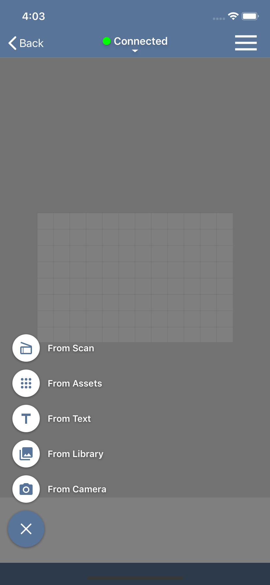
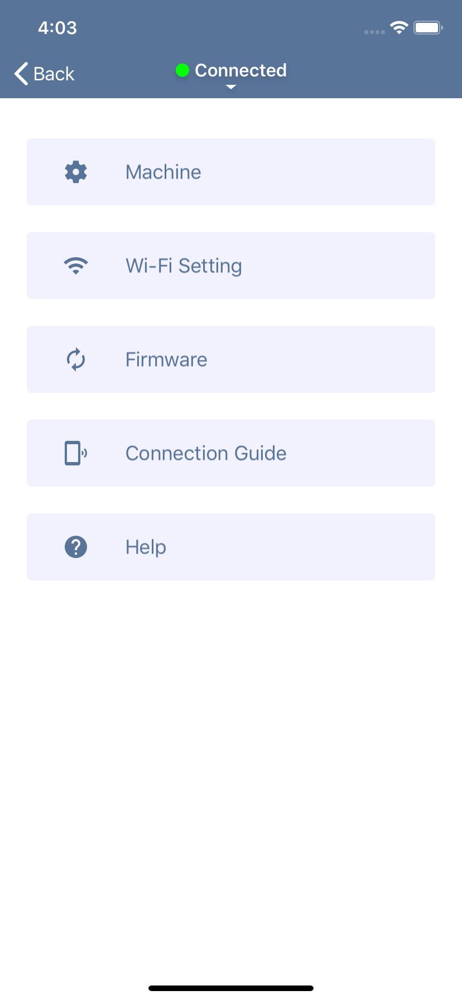
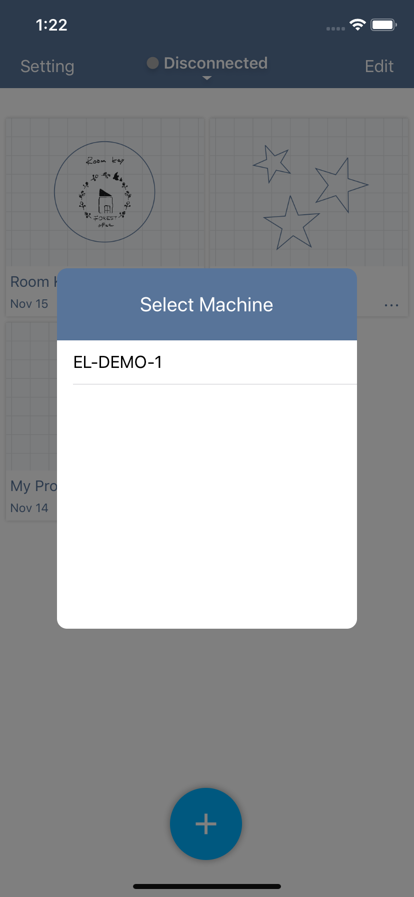

# Product outline
EtcherLaser App is application for laser processing, compatible with the EtcherLaser.
This is application that takes in image data, edits the layout, sets laser parameters, and performs processing.

---

<p align="center">

</p>

## Product Specification
### Supported products
EtcherLaser

### Supported files
png / jpg / tif

### Software operating requirements
#### iOS
- iOS 11 or later

#### Android
- Not compatible

## Document Disclaimer
- Screen shots, etc. of this manual may differ from the actual display of the software.
- Contents may be updated without notice.
- Please note that we cannot accept any responsibility for detriment, lost profits, etc. due to the operation of this product.
- Apple, App Store, Apple logo, Mac, Mac OS, OS X, macOS, iPad, iPhoto, iPod touch, and iTunes are trademarks of Apple Inc.


https://web.messageplus.jp/information/help/app/iOS/index.html

<div style="page-break-before:always"></div>

# Name of each part
## Project list

A list of created projects is displayed. Tap each project to open the project edit screen.
Also, If you tap **…** at the bottom right of the cell, you can edit the project name and duplicate / delete the project.

<p align="center">

</p>

If you want to delete project files at once, you can delete them in the following procedure.
1. Tap “Edit” at the top right of the screen to switch to edit mode.
2. Select the projects to be deleted.
3. Click the trash can icon at the top left of the screen.
4. Tap “Done” at the top right of the screen to exit edit mode.


## Project editing

On this screen, you can edit the project to create machining data.

### Add Item menu

Tap the “+” button at the bottom left to add a processed item.

- Scan: Add image Item by scanned with the camera of the machine.
- Assets: Add item from assets included in the app.
- Text: Add text item from text.
- Library: Add item from images stored in the iOS camera roll.
- Camera: Launch the iOS camera and add item from the captured image.

<p align="center">

</p>

### Item list view
The added items is displayed at the bottom of the screen.
Click the thumbnail to display the parameter setting screen.
If you want to delete an item, touch and hold the thumbnail and tap “Delete”.

<p align="center">

</p>

### Parameter Setting view
It is displayed when you click an item displayed in the item list, and you can set the processing parameters of the target item.

- Manual: You can set parameters manually. In addition, the set parameters can be registered in the user dictionary.
- User dictionary: Registered parameters can be selected.


### Machine control menu
- Start: Create processing data for the opened project and send it to the machine.
- Stop operation: Stops the operation of EtcherLaser during machining.
- Origin return: Move the laser head to the machine origin.
- Capture: Displays the image of the work area on the canvas.
- Position confirmation: The laser head can be moved. This is used when adjusting the focal length.

<p align="center">

</p>

## Setting
- Setting: You can make various settings.

<p align="center">

</p>

<div style="page-break-before:always"></div>

# Parameter settings
This section explains the parameter setting items.

<p align="center">

</p>


## Speed
Set the moving speed of the laser head during processing (during laser irradiation). As the speed decreases, the energy of the laser given to the material increases.
```
※ It can be set in the range of 50-8000 [mm / min].
```

## Power
Set the intensity of laser irradiation. The greater the power, the greater the energy of the laser given to the material.
```
※ It can be set in the range of 0-100 [%].
```

## Number of times
Specify the number of times of laser processing. If a large amount of energy at one time adversely affects the material (melting or charring), repeated processing with small energy can be expected to improve the processing results.
```
※ It can be set in the range of 0-10 [times].
```

## DPI
This parameter is valid for raster processing. Set the definition when performing processing (dithering) to express the tone of the image. By default, 254 DPI is set, which is the value at which the laser is emitted every 0.1 mm. Also, unlike liquid crystal displays etc., the size of the laser irradiation point itself does not change even if DPI is raised. Please be aware that if you raise DPI too much the whole will be burned too much.

```
※ You can set in the range of 72-300 [DPI].
※ All the images below are engraved with the same image data and the same processing size.
※ It can be set individually according to the material characteristics or processing time efficiency.
```

Imprinted cardboard with FABOOL Laser Mini 3.5W / Use image: 1023x778 pixels

<p align="center">

</p>


## Hatching
This parameter is valid when processing a vector (painting) image. Hatching is a method of representing a surface by overlapping fine parallel lines, and is used to represent “filling” by laser processing. With hatching parameters, you can set the spacing between these parallel lines.
```
※ The interval can be set in the range of 0.05-3.0 [mm].
※ Text painting processing is also treated as vector (painting).
※ The impression of the processing result is different depending on the line width of the actual laser irradiation and the characteristics of the material.
```

<div style="page-break-before:always"></div>

# Machining operation
This section explains how to laser processing.

First, open the project to be processed, and display the project edit screen.

## Connect to machine
If you are not connected to the machine, tap “Disconnected” at the top of the screen, then tap “Connect”.
Tap the serial number of the target EtcherLaser to connect to the machine.

## Setting of focal length

Open the machine operation menu and tap Position Check.
Drag the displayed laser head on the material and tap the "Move" button.

When the laser head moved over the material, use the height adjustment jig to adjust the focal length.
※If the laser head is tilted, it may cause misalignment.

When the height adjustment is complete, press “Back” on the screen to return to the project editing screen.

## Check position

Open the machine operation menu and tap the “Capture” button. Enter the capture surface height here.
※ Usually, enter the height of the material (the height of the machining surface from the machining bed).
※ When machining with the bottom open, enter the height of the machining surface as a negative value based on the machining bed.
※ If the entered height is not correct, it may cause misalignment.

## Position adjustment
When the capture is complete, the captured image of the work area is displayed on the canvas.
Check the positional relationship with the graphics item and adjust the position of the graphics item or material.

## Processing start

### Safety check items

Is the height of the laser head correctly adjusted?
Are there any obstacles in the processing area or near the processing machine?
Is the bottom plate closed properly?
When processing with the bottom open, is the base under the material safe from burning?
(Laser light may reach the base depending on the thickness of the material)
Is the processing range completely over the material?

-----------------

Open the machine operation menu and tap the “Start” button to display the estimated machining time.
Tap the “Start” button and the processing data will be sent to EtcherLaser.
After that, press and hold the start button (flashing green) of the processing machine to actually start processing.

<div style="page-break-before:always"></div>

# User setting
This section describes the settings.

<p align="center">

</p>

## Machine
You can set the machining position offset here.
If there is a discrepancy between the captured image and the actual processing position, change this value (unit: mm).
- Offset X: Entering a positive value moves the machining position to the right.
- Offset Y: Entering a positive value moves the machining position downward.

Misalignment of the machining position can also occur for the following reasons. Please check here once.
- If the height setting at capture is not appropriate
- When the laser head is tilted when adjusting the height of the laser head

## Wi-Fi Setting
If there is a Wi-Fi router in the environment where EtcherLaser is used, you can connect to EtcherLaser via LAN by entering the setting information of that router.

## Firmware
If app has latest firmware, you can update it here.
Since the firmware is included in the app, we recommend that you keep the app up to date.

## Connection Guide
Use this connection guide when connecting directly to EtcherLaser. By reading the QR code on the back of EtcherLaser, you can connect your smartphone and EtcherLaser via Wi-Fi.

## Help
Open the EtcherLaser guide page.

<div style="page-break-before:always"></div>

# Connection to machine
This section explains how to connect the app and EtcherLaser machine.


## Wi-Fi connection method between smartphone and EtcherLaser

To operate EtcherLaser from the app, you need to connect your smartphone and EtcherLaser via Wi-Fi.
There are the following two types of Wi-Fi connection methods.

### Direct connection to EtcherLaser
Connect EtcherLaser to EtcherLaser using EtcherLaser as an access point.
The connection method used by the connection guide is this method.
It can be connected easily and does not require a router, but you cannot connect to the Internet while connected.

<p align="center">

</p>


### Connect to EtcherLaser via Wi-Fi router
If you have a Wi-Fi router in your environment, you can connect to EtcherLaser via this router.
The setting method is as follows.

```
EtcherLaser only supports 2.4GHz.
When connecting to the router, connect with 2.4GHz.
*In many cases, characters such as "G" and "2G" are included in the SSID.
```

1. Connect directly to EtcherLaser.
2. Open Apps> Settings> Wi-Fi settings and enter the account information for your Wi-Fi router.
3. Tap the write button and restart EtcherLaser when the write is complete.
4. Change the Wi-Fi connection destination of the smartphone to your Wi-Fi router.


A Wi-Fi router must be required, but with this method you can operate EtcherLaser while connected to the Internet.  
* When the Wi-Fi router is connected to the Internet.

<p align="center">

</p>

## How to connect the app and EtcherLaser
After connecting to EtcherLaser via Wi-Fi, a list of EthcerLaser that can be connected to the list of machines will be displayed.
If you tap the EthcerLaser you want to use, connection has complete.

<p align="center">

</p>

<div style="page-break-before:always"></div>
