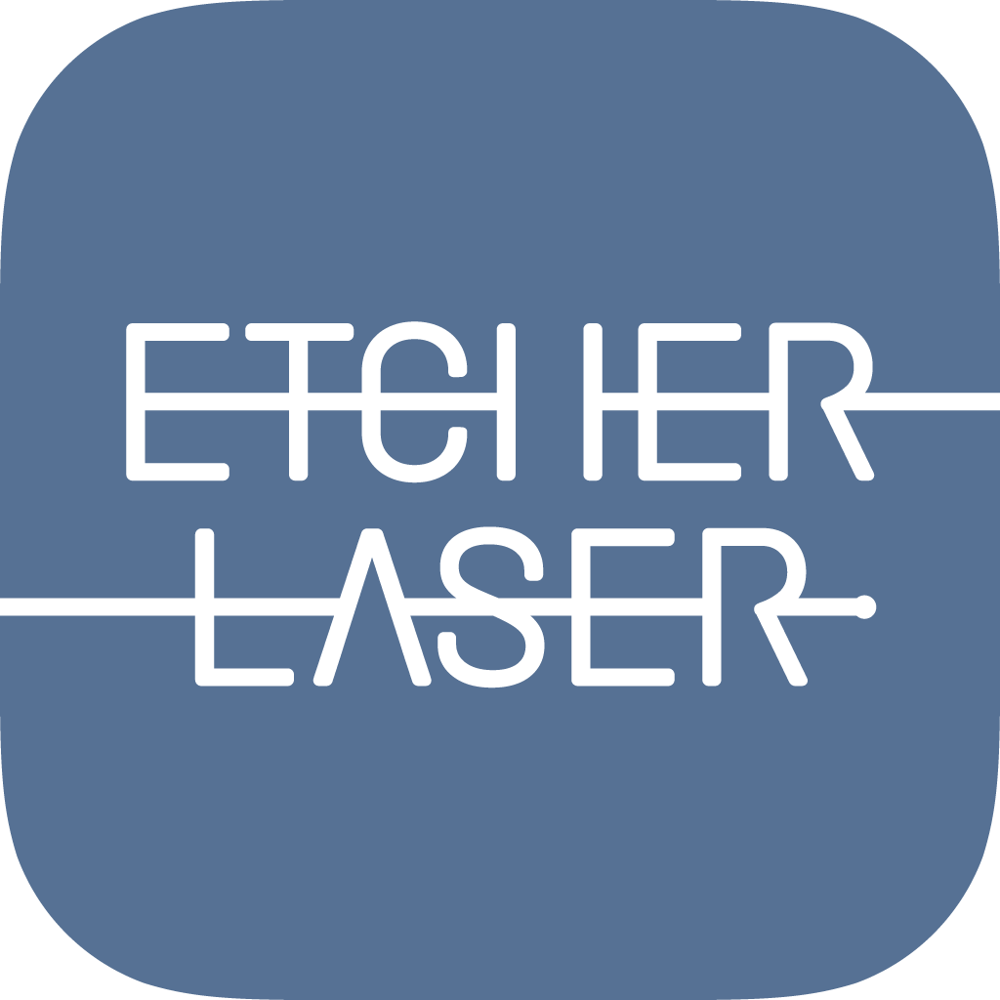

EtcherLaser App is an application for laser processing, compatible with the Etcher Laser.
This is an application that takes in image data, edits the layout, sets laser parameters, and performs processing.

---

## Product Specification
### Supported products
Etcher Laser / Etcher Laser Pro

### Supported files
png / jpg / gif / bmp / svg

### Software operating requirements
#### iOS
- iOS 11 or later

#### Android
- Android 4.4 or later

## Document Disclaimer
- Screenshots, etc. in this manual may differ from the actual display of the software.
- Contents may be updated without notice.
- Please note that we cannot accept any responsibility for detriment, lost profits, etc. due to the operation of this product.
- Apple, App Store, Apple logo, Mac, Mac OS, OS X, macOS, iPad, iPhoto, iPod touch, and iTunes are trademarks of Apple Inc.
- Google, Google Play, Google Play logo, Android, and Android logo are trademarks of Google Inc.
