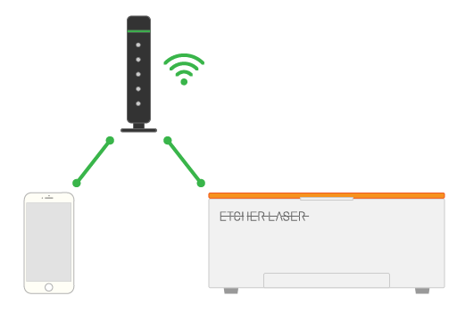

# EtcherLaserとの接続

スマートフォンとEtcherLaserはWi-Fiで接続することができます。
また、このWi-Fiの接続方法は下記の2種類があります。

## EtcherLaserへ直接接続
EtcherLaserをアクセスポイントとして、スマートフォンからEtcherLaserへ接続します。
接続ガイドで設定させる接続方法はこちらの方法となっております。
手軽に接続することができ、ルータも必要ありませんが、接続中はインターネットへの接続ができません。

<p align="center">

</p>


## Wi-Fiルータ経由でEtcherLaserへ接続
EtcherLaserをお使いの環境にWi-Fiルータがある場合、このルータ経由でEtcherLaserへ接続することができます。
設定方法は下記の通りです。

```
EtcherLaserは2.4GHzのみ対応しております。
ルータに接続する場合は2.4GHzで接続してください。
※多くの場合、SSIDに"G"や"2G"などの文字が入ります。
```

1. EtcherLaserへ直接接続します。
2. アプリ > 設定 > Wi-Fi 設定を開き、お使いのWi-Fiルータの設定情報を入力します。
3. 書き込みボタンをタップし、書き込みが完了したらEtcherLaserを再起動します。
4. スマートフォンのWi-Fi接続先をお使いのWi-Fiルータへ変更します。


Wi-Fiルータが設置されている必要がありますが、この方法ではインターネット接続をしながらEtcherLaserを操作することができます。
※Wi-Fiルータがインターネットに接続されている場合

<p align="center">

</p>
