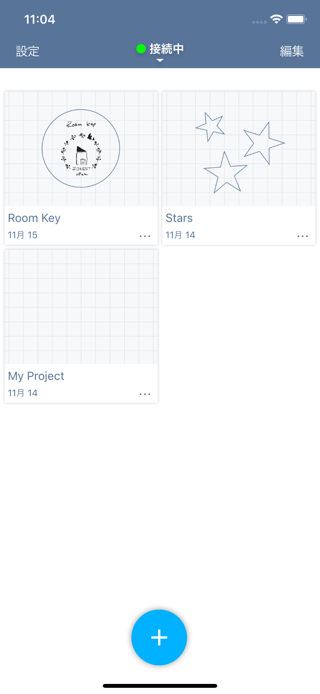
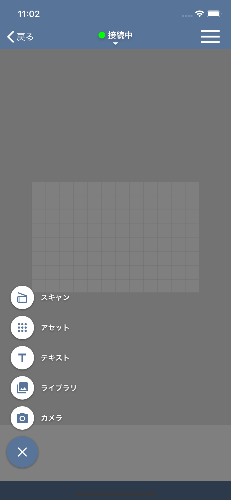
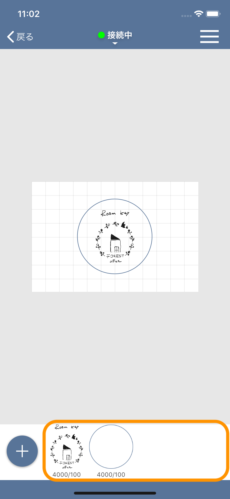
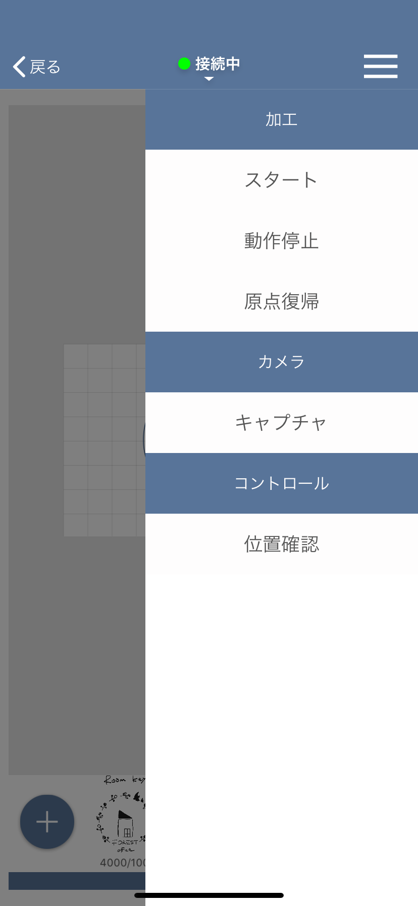
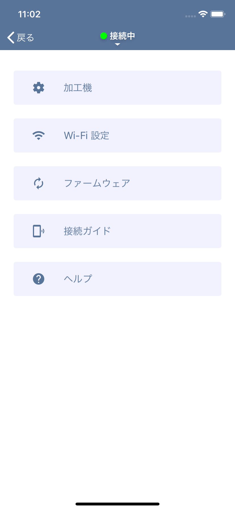

## Project list

A list of created projects is displayed. Tap each project to open the project edit screen.
Also, If you tap **…** at the bottom right of the cell, you can edit the project name and duplicate / delete the project.

If you want to delete project files at once, you can delete them in the following procedure.
1. Tap “Edit” at the top right of the screen to switch to edit mode.
2. Select the projects to be deleted.
3. Click the trash can icon at the top left of the screen.
4. Tap “Done” at the top right of the screen to exit edit mode.

## Project editing

On this screen, you can edit the project to create machining data.

### Add Item menu

Tap the “+” button at the bottom left to add a processed item.

- Scan: Add image Item by scanned with the camera of the machine.
- Assets: Add item from assets included in the app.
- Text: Add text item from text.
- Library: Add item from images stored in the iOS camera roll.
- Camera: Launch the iOS camera and add item from the captured image.

### Item list view
The added items is displayed at the bottom of the screen.
Click the thumbnail to display the parameter setting screen.
If you want to delete an item, touch and hold the thumbnail and tap “Delete”.

### Parameter Setting view
It is displayed when you click an item displayed in the item list, and you can set the processing parameters of the target item.

- Manual: You can set parameters manually. In addition, the set parameters can be registered in the user dictionary.
- User dictionary: Registered parameters can be selected.

### Machine control menu
- Start: Create processing data for the opened project and send it to the machine.
- Stop operation: Stops the operation of EtcherLaser during machining.
- Origin return: Move the laser head to the machine origin.
- Capture: Displays the image of the work area on the canvas.
- Position confirmation: The laser head can be moved. This is used when adjusting the focal length.

## Setting
- Setting: You can make various settings.

