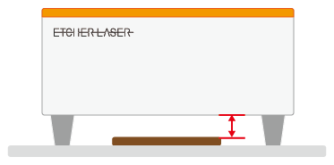

This section explains how to start laser processing.  
First, open the project to be processed, and display the project edit screen.

## Connect to machine
If you are not connected to the machine, tap “Disconnected” at the top of the screen, then tap “Connect”.
Tap the serial number of the target Etcher Laser to connect to the machine.

## Setting the focal length

Open the machine operation menu and tap Position Check.
Drag the displayed laser head on the material and tap the "Move" button.

When the laser head is moved over the material, use the height adjustment jig to adjust the focal length.  
※ If the laser head is tilted, it may cause misalignment.

When the height adjustment is complete, press “Back” on the screen to return to the project editing screen.

## Check position

Open the machine operation menu and tap the “Capture” button. Enter the capture surface height here.

※ If the entered height is not correct, it may cause misalignment.  
※ Usually, enter the thickness of the material (the height of the material surface from the processing bed).  
※ If the material does not reach the bottom of the Etcher Laser, the value set when capturing with the camera is not the same as the thickness of the material. Measure from the bottom of the Etcher Laser to the surface of the material and enter that value as a negative. For example, if the top of the material is 10 mm away from the bottom of the Etcher Laser (the distance represented by the red arrows in the image below), you would enter “-10 mm” as the material thickness.

## Position adjustment
When capturing is complete, the captured image of the work area is displayed on the canvas.
Check the position of the image/design, and make adjustments as desired.

## Processing start

### Safety check items

- Is the height of the laser head correctly adjusted?
- Are there any obstacles in the processing area or near the processing machine?
- Is the bottom plate closed properly?
- When processing with the bottom open, is the base under the material safe from burning?  
(Laser light may reach the base depending on the thickness of the material)
- Is the processing range completely over the material?

-----------------

Open the machine operation menu and tap the “Start” button to display the estimated processing time.
Tap the “Start” button and the processing data will be sent to the Etcher Laser.

After that, press and hold the start button (flashing green) of the processing machine to actually start processing.
