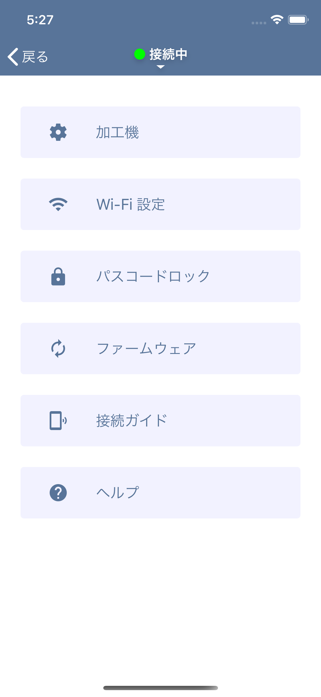

This section describes the settings.

## Machine
You can set the machining position offset here.
If there is a discrepancy between the captured image and the actual processing position, change this value (unit: mm).
- Offset X: Entering a positive value moves the machining position to the right.
- Offset Y: Entering a positive value moves the machining position downward.

Misalignment of the machining position can also occur for the following reasons. Please check here once.
- If the height setting at capture is not appropriate
- When the laser head is tilted when adjusting the height of the laser head

## Wi-Fi Setting
If there is a Wi-Fi router in the environment where EtcherLaser is used, you can connect to EtcherLaser via LAN by entering the setting information of that router.

## Firmware
If app has latest firmware, you can update it here.
Since the firmware is included in the app, we recommend that you keep the app up to date.

## Connection Guide
Use this connection guide when connecting directly to EtcherLaser. By reading the QR code on the back of EtcherLaser, you can connect your smartphone and EtcherLaser via Wi-Fi.

## Help
Open the EtcherLaser guide page.
